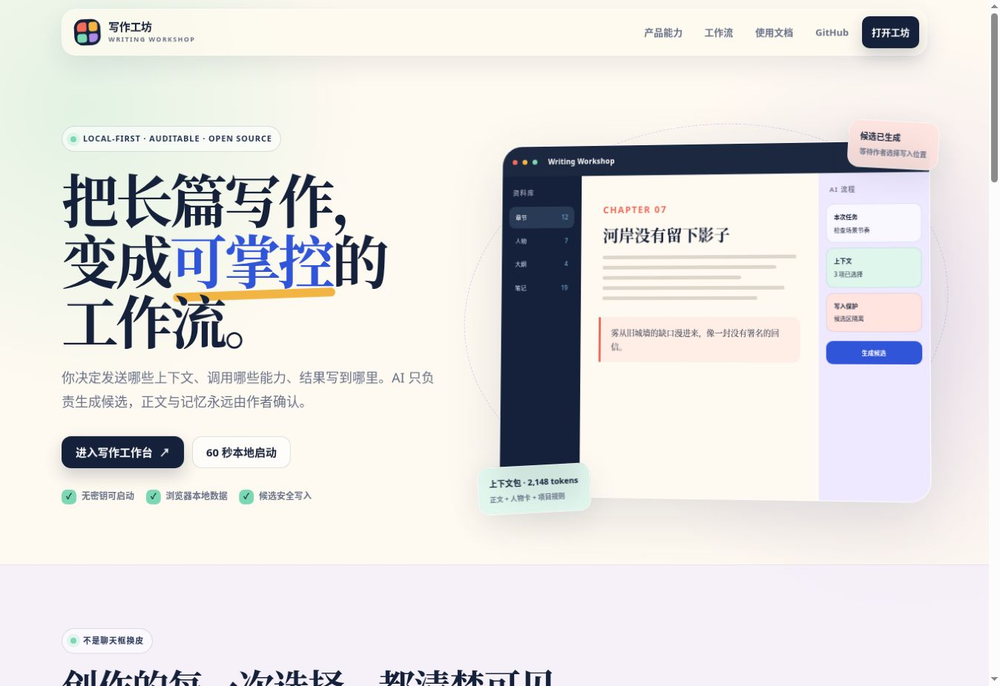
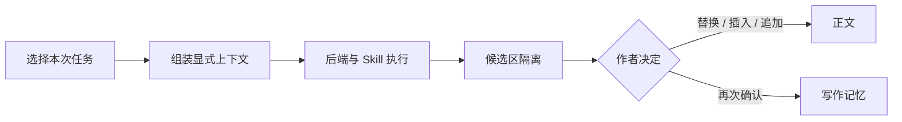
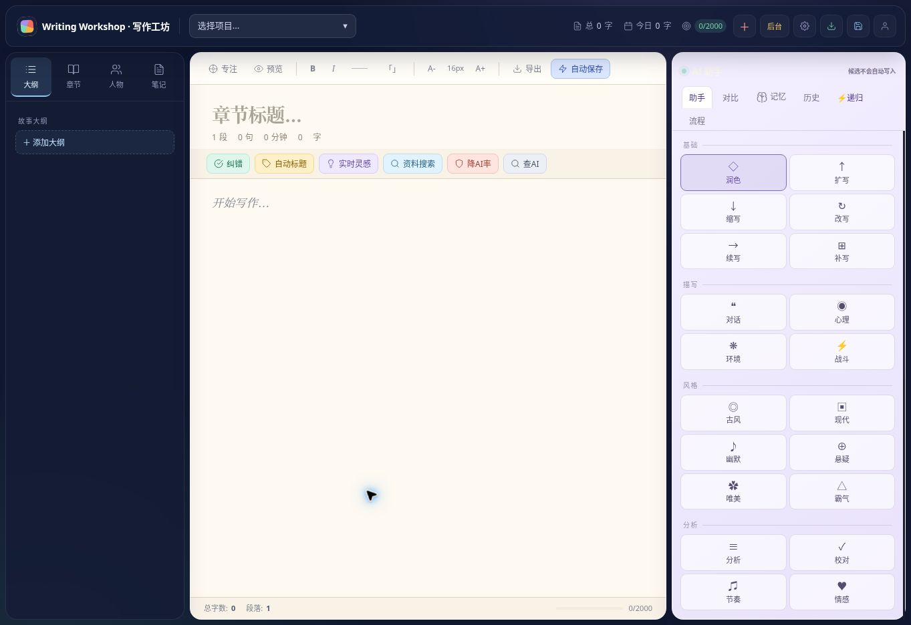
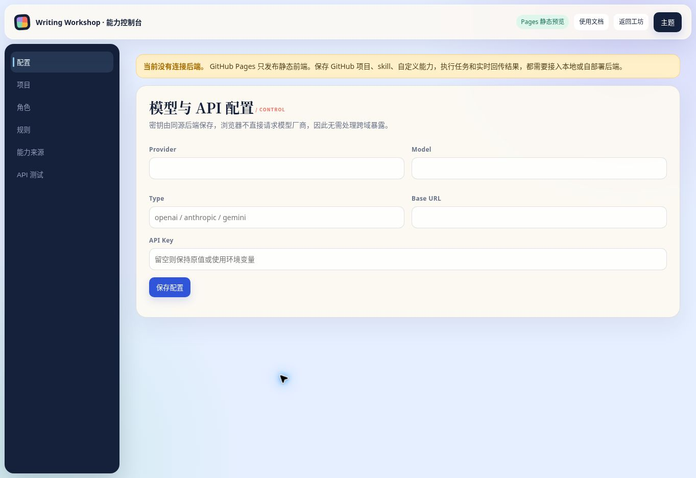

# Writing Workshop / AI 写作工坊

[](https://github.com/zizegak916-glitch/writing-workshop/actions/workflows/ci.yml)
[](LICENSE)

一个本地优先、可审计的长篇写作工作台。它把“选哪些上下文、运行哪些 Skill、结果写到哪里”变成显式操作：AI 只生成候选，作者确认后才写入正文或记忆。

它不是聊天框的换皮，也不会把整部作品在每次调用时重新发送给模型。

**在线体验：** [GitHub Pages](https://zizegak916-glitch.github.io/writing-workshop/) · [完整使用文档](https://zizegak916-glitch.github.io/writing-workshop/docs.html) · [能力后台](https://zizegak916-glitch.github.io/writing-workshop/admin.html)

> Pages 是静态交互预览，可以使用浏览器本地数据；模型调用、服务端配置和 Skill 执行需要启动仓库自带的同源后端。这样做是为了避免在公开网页中暴露 API Key，也从架构上避开 CORS 问题。



## 现在能做什么

- 管理项目、章节、大纲、人物卡、规则和写作记忆。
- 为一次任务显式选择正文、项目、大纲、人物与记忆，实时查看字符和 token 估算。
- 组合后端与 Skill 执行任务；支持 SSE 流式结果和中断。
- 逐项多选 Skill，或一键应用“长篇规划校准 / 章节修订 / 角色与对白”技能包；自定义技能包会持久化保存。
- 搜索、筛选、重命名、复制、分类、导出和删除浏览器本地项目；自定义分类也可用于写作记忆。
- 候选结果与正文分离；替换、插入、追加、写入记忆均需独立确认。
- 保存写入前快照和流程历史，避免 AI 输出静默覆盖创作内容。
- 在无 API Key 模式下运行本地链路测试和大纲拆分；需要模型时再配置 OpenAI 兼容服务、OpenRouter、Ollama 等后端。

## 60 秒启动

### Docker（推荐）

```bash
git clone https://github.com/zizegak916-glitch/writing-workshop.git
cd writing-workshop
docker compose up --build
```

打开 <http://127.0.0.1:8080/app.html>。首次以无密钥 demo 模式启动；可在管理页配置模型。配置保存后，容器重启会自动加载它。

健康检查：

```bash
curl http://127.0.0.1:8080/api/health
# {"mode":"demo","status":"ok"}
```

### 从源码运行

需要 Go 1.25 或更高版本。

```bash
go build -o writing-workshop ./cmd/writing-workshop
./writing-workshop serve --demo --port 8080
```

若需局域网或容器访问，显式增加 `--host 0.0.0.0`。默认只监听 `127.0.0.1`，避免意外暴露本地作品和密钥配置。

## 核心闭环

1. 在编辑器中打开正文或选择一段文字。
2. 在“流程”页选择本次任务、上下文和 Skill。
3. 先查看将发送的上下文规模，再运行任务。
4. 输出进入候选区，不会自动修改作品。
5. 作者选择替换、插入、追加，或另行确认为记忆。
6. 写入前状态保存在流程历史中，可回看和恢复。

这个闭环是 Writing Workshop 与继承引擎能力之间的产品边界：引擎可以生成，工作台负责上下文控制、权限可见、结果确认和创作数据管理。



## 界面与导航

新版界面采用“彩色编辑部”设计：深色资料栏、暖纸张编辑器和淡紫 AI 区承担不同职责，钴蓝、珊瑚、薄荷和琥珀只用于表达动作和状态。桌面保留三栏生产布局，移动端切换为底部任务导航。



| 页面 | 作用 |
|---|---|
| `index.html` | 产品说明、运行模式和 60 秒启动入口 |
| `app.html` | 项目、章节、大纲、人物、记忆、分类、导入导出、多 Skill 与候选写入 |
| `admin.html` | Provider、Model、Base URL、API Key、项目、规则、能力、技能包、分类与 API 调试 |
| `docs.html` | 从 Pages / 本地模式区别到 CORS、Skill 与故障排查的完整教程 |

视觉规范与组件约束见 [UI 设计系统](docs/UI_DESIGN_SYSTEM.md)。

后台不是装饰页：Provider、Model、Base URL、API Key、项目、角色、规则、能力来源与 API 测试都有明确入口。Pages 中显示静态预览状态，本地运行后自动连接同源 API。



## Skill / 能力协议

能力清单不是任意远程代码执行入口。仓库当前只登记、校验和组合 manifest；第三方代码必须经过未来的沙箱执行器才允许运行。

最小 manifest：

```json
{
  "name": "场景节奏检查",
  "type": "skill",
  "category": "revision",
  "tags": ["节奏", "修订"],
  "version": "1.0.0",
  "source": "https://github.com/example/scene-pacing",
  "license": "Apache-2.0",
  "entry": "prompt:scene-pacing",
  "output": "text",
  "instructions": "保持事件顺序，只指出节奏断点并给出候选修改。",
  "steps": ["读取显式上下文包", "检查场景节奏", "返回候选文本"],
  "permissions": ["context:read"],
  "supports_stream": true,
  "supports_abort": true,
  "enabled": true
}
```

完整字段和 API 示例见 [能力协议](docs/CAPABILITY_PROTOCOL.md) 与 [API 文档](API.md)。

技能包不是新的执行权限，而是一组可见的 `skill_ids` 预设。工作台应用技能包后，仍会显示选中数量，并把所有 Skill ID 显式传给 `/api/run`。分类有两处真实存储边界：工作台项目分类保存在当前浏览器，能力后台分类保存在当前后端工作目录的 `.ainovel/categories.json`。

## 数据与安全边界

- 项目数据默认写入本地输出目录；浏览器使用同源 `/api/`，不直连模型厂商，从根源上避开 CORS 密钥暴露。
- 默认监听回环地址；如使用 `0.0.0.0`，请只在可信网络或反向代理鉴权后开放。
- API Key 可使用环境变量，不必写入仓库；配置读取时会对外隐藏密钥。
- 保存 GitHub URL 不等于执行仓库代码。

详见 [配置指南](CONFIG.md) 与 [安全策略](SECURITY.md)。

## 项目结构

```text
cmd/writing-workshop/  项目可执行入口
internal/web/       同源 Web API、SSE、能力执行与数据管理
web/static/         本地优先的写作工作台、项目管理扩展与新 SVG 图标
internal/store/     章节、大纲、人物、记忆和运行状态
examples/           可复用能力 manifest 与技能包请求示例
docs/               协议、来源与设计说明
```

## 路线图

- `v0.1`：无密钥启动、显式上下文包、候选确认、Skill manifest、CI 与跨平台发布。
- `v0.2`：项目导入/导出包已覆盖项目、章节、大纲、人物与记忆；继续补可复现的端到端浏览器测试和能力版本锁定。
- `v0.3`：最小权限的本地 Skill 沙箱与增量资料摄取。

公开任务请使用 [GitHub Issues](https://github.com/zizegak916-glitch/writing-workshop/issues)。提交代码前阅读 [CONTRIBUTING.md](CONTRIBUTING.md)。

维护者社区账号：[Linux DO · The_o0l](https://linux.do/u/The_o0l)。

维护者可使用 `make check` 运行与 CI 对齐的本地检查。Codex for Open Source 的证据清单与申请草稿见 [docs/CODEX_FOR_OSS_APPLICATION.md](docs/CODEX_FOR_OSS_APPLICATION.md)。

## 来源与许可证

本项目的 Go 写作引擎源自 Apache-2.0 许可的 [`voocel/ainovel-cli`](https://github.com/voocel/ainovel-cli)。本仓库保留原作者版权、提交历史和 Apache-2.0 许可证，并在其上开发独立的 Writing Workshop Web 产品层、能力协议、显式上下文工作流与发布设施。继承引擎的历史技术说明保存在 [docs/UPSTREAM_ENGINE.md](docs/UPSTREAM_ENGINE.md)。
