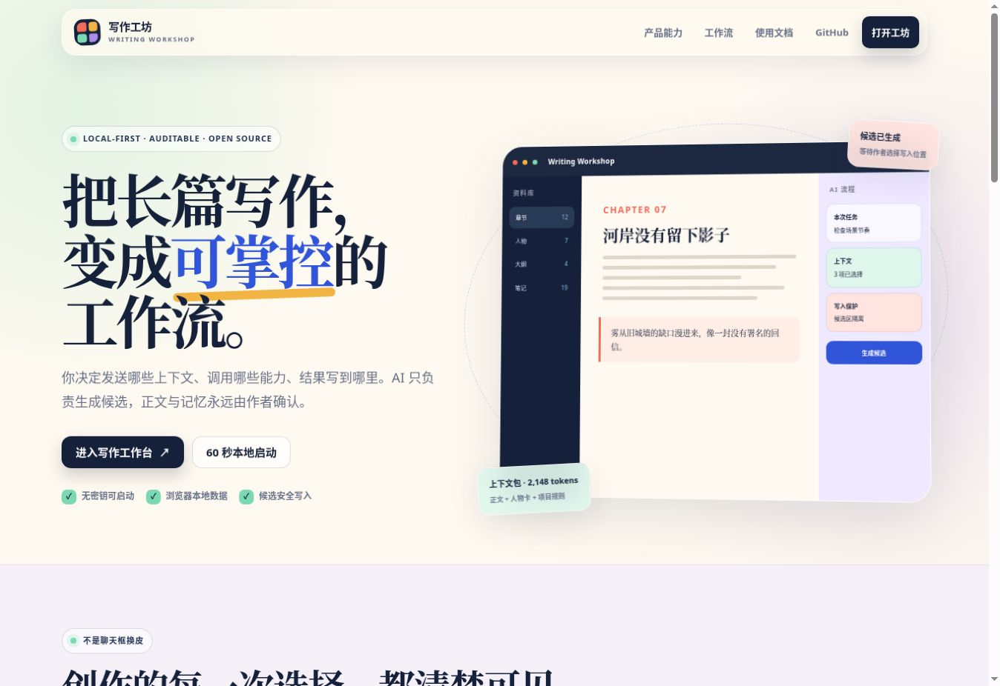
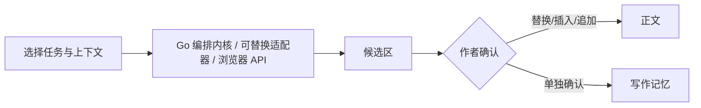

# Writing Workshop / AI 写作工坊

[](https://github.com/zizegak916-glitch/writing-workshop/actions/workflows/ci.yml)
[](LICENSE)

Writing Workshop 是一个本地优先、作者确认写入的长篇创作工作台。项目、正文、章节、大纲、人物、笔记、记忆、自定义分类和 Prompt Skill 可以在同一项目中管理；每次 AI 请求由作者显式选择上下文，结果先进入候选区，不会自动覆盖正文。

**在线版：** [GitHub Pages](https://zizegak916-glitch.github.io/writing-workshop/) · [使用教程](https://zizegak916-glitch.github.io/writing-workshop/docs.html) · [问题反馈](https://github.com/zizegak916-glitch/writing-workshop/issues)

GitHub Pages 是正式 HTTPS 静态站点，不是 Sites 预览。它可以在浏览器本地完成项目管理、导入导出、Prompt Skill、授权语料校准与 BYOK 模型调用；Key 和资料不会进入仓库。浏览器直连仍要求模型接口允许当前站点跨域。需要服务端托管密钥、后端 Skill、Go 语料分析和同源 API 时，使用 Docker 或本地可执行文件。



## Go 编排内核与开放适配层

Writing Workshop 默认使用仓库内的 Go 编排内核，代码位于 `internal/engine/`。这样可以把上下文、工具权限、候选写入和中断语义握在产品自己手里；同时，模型与外部能力都通过小接口进入，不把“自研”理解成拒绝成熟实现。

- 原生消息、工具、事件、用量与模型接口；
- 可中断的 Agent 工具循环和工具执行门；
- 上下文预算、压缩投影和工具结果微压缩；
- 隔离的子任务运行上下文；
- OpenAI Chat、OpenAI Responses、Anthropic Messages、Ollama 四种 HTTP 协议；
- 保留 BOM/CRLF、拒绝越界路径和歧义替换的安全编辑工具。

现有 `ChatModel`、四协议适配器、可切换模型与 failover 已经是兼容边界。后续接入优秀外部引擎时，优先做薄适配并保留其优势，不复制整套实现，也不让第三方运行时绕过 Writing Workshop 的作者确认、工具门和数据边界。详见 [引擎与适配层](docs/NATIVE_ENGINE.md)。

## 授权语料校准实验室

“流程 → 授权语料校准”可以导入你有权分析的 TXT、Markdown 或 DOCX 网文/稿件。它不是训练模型，也不提供具体作者仿写：

1. 导入前必须确认拥有分析权限；
2. 引擎计算章节、段落、句长、节奏、对话比例、标点与重复表达等聚合信号；
3. 只保存文件哈希、元数据、聚合指标和派生规则，不保存原文；
4. 生成的是 Prompt Skill 候选差分，作者预览后才可应用；
5. 每次应用保留修改前快照，可精确撤销；
6. 内置反规则禁止复刻作者身份、专名、情节和来源句子。
7. 多本语料按来源等权形成中位基线，分歧会降级为弱约束；续写、节奏、对白与润色获得不同差分，不再共用一锅规则。

自部署版由 Go `internal/corpus` 分析并保存档案到 `.writing-workshop/corpus/index.json`；Pages 在浏览器内分析，原文不离开当前页面，也不持久化。完整边界见 [语料校准说明](docs/CORPUS_CALIBRATION.md)。

## 现在能做什么

- 管理项目、正文与章节、大纲、人物卡、项目笔记、规则、写作记忆和自定义分类。
- 导入 TXT、Markdown、DOCX 或旧版项目包；导出 v6 完整项目备份。
- 选择正文、项目信息、大纲、人物、记忆和额外指令，提前查看 token 估算。
- 使用 32 个可查看、修改、恢复和迁移的内置 Prompt Skill；任务定义之下共享证据优先级，并按修改、生成、分析、策划和研究使用不同执行链。
- 多选后端 Skill，或应用“长篇规划校准 / 章节修订 / 角色与对白”等技能包。
- 将 AI 输出隔离到候选区，再确认替换、插入、追加或写入记忆。
- 按项目保存候选、流程历史和写入前快照，阻止跨文档旧坐标写入。
- 在 Pages 使用浏览器 BYOK，或由自部署 Go 服务托管 Key 和同源 `/api/`。
- 以停用元数据登记外部 Skill 来源；当前不会下载或执行陌生仓库代码。

## 60 秒启动

### 直接使用 Pages

1. 打开 [在线工作台](https://zizegak916-glitch.github.io/writing-workshop/app.html)。
2. 点击顶部 `＋` 创建项目，或从项目操作台导入文件。
3. 需要 AI 时打开“设置 → API”，填写协议、Base URL、模型和 Key，先点测试再保存。
4. 在编辑器选择文本，选一个功能，检查上下文预算后生成。
5. 在候选区确认写入；重要阶段导出 v6 项目包。

Pages 保存 API 配置不会请求静态 `/api/config`，因此不会因保存动作产生 405。若测试失败，优先检查完整端点、鉴权方式、模型 ID、CORS 与 HTTPS 混合内容。

### Docker（完整自部署）

```bash
git clone https://github.com/zizegak916-glitch/writing-workshop.git
cd writing-workshop
docker compose up --build
```

打开：

- 工作台：<http://127.0.0.1:8080/app.html>
- 本地服务控制台：<http://127.0.0.1:8080/admin.html>
- 健康检查：<http://127.0.0.1:8080/api/health>

首次以无密钥 demo 模式启动。配置、能力、分类、技能包与语料统计保存在映射出的 `./config`，容器内路径为 `/root/.writing-workshop`。

### 从源码运行

需要 Go 1.25.5 或更高版本：

```bash
go build -o writing-workshop ./cmd/writing-workshop
./writing-workshop serve --demo --port 8080
```

默认只监听 `127.0.0.1`。公网使用前请增加 HTTPS、登录鉴权、请求大小限制和访问控制；不要直接暴露 8080。

## 核心闭环


```mermaid
flowchart LR
    A[选择任务与上下文] --> B[Go 编排内核 / 可替换适配器 / 浏览器 API]
    B --> C[候选区]
    C --> D{作者确认}
    D -->|替换/插入/追加| E[正文]
    D -->|单独确认| F[写作记忆]
```

功能 Prompt Skill、当前文本、项目上下文和作者额外指令会按可检查的顺序组装。Skill 内部先处理用户指令、正式设定、局部人物/世界资料、原文、授权语料信号和通用经验的优先级；语料指标不是写作配额。模型结果与当前文档版本不一致时，旧候选不能按旧坐标强写。

## 两类 Skill，不混为一谈

| 类型 | 存放位置 | 作用 | 当前边界 |
|---|---|---|---|
| 浏览器 Prompt Skill | 内置定义 + 当前 origin `localStorage` | 为 32 个写作功能组装提示词 | 无代码执行权限；可随 v6 备份迁移 |
| 后端 capability Skill | 内置清单或 `.writing-workshop/capabilities.json` | 为 `/api/run` 组合步骤和权限 | 仅执行已启用内置能力；外部来源默认停用 |
| 技能包 | `.writing-workshop/skill-packs.json` | 保存一组可见的 Skill ID | 不增加权限，不绕过服务端校验 |

第三方 Skill 沙箱仍未交付。粘贴 GitHub 地址只登记来源和 manifest，不会下载或运行代码。

## 数据边界

- Pages 项目数据位于当前域名的 IndexedDB/localStorage；`github.io`、自定义域名、`localhost` 是不同的数据空间。
- v6 项目包包含项目、章节、大纲、人物、笔记、记忆、候选/恢复快照、自定义分类、Prompt Skill 覆盖值和语料统计档案，不包含导入语料原文。
- Go 服务使用 `.writing-workshop/`。若只存在旧 `.ainovel/` 配置，程序可读取并提示迁移，但新写入只进入 `.writing-workshop/`。
- 浏览器项目与 Go 后端项目不会静默双向同步；通过导入/导出显式迁移。
- Pages BYOK 的 Key 保存在当前浏览器，不是加密保险箱；不要在公共设备使用。
- 自部署配置读取接口会隐藏 API Key 与自定义鉴权头。

## 项目结构

```text
cmd/writing-workshop/  可执行入口
internal/engine/       仓库自有 Go Agent、上下文、协议与安全编辑
internal/corpus/       授权语料抽取、聚合指标、候选校准
internal/web/          同源 API、SSE、能力与数据管理
web/static/            Pages / 自部署共用工作台
internal/store/        后端章节、人物、记忆和运行状态
tests/                 浏览器产品烟雾测试
docs/                  用户、架构、历史与发布证据
```

## 当前验证边界

- 原生 Agent 循环、工具门、用量累积、上下文压缩、四协议请求、编辑安全、配置迁移、语料去重与撤销已有 Go 测试。
- 浏览器测试覆盖 v1–v5→v6、候选恢复、跨文档保护、Pages 配置和语料校准闭环；CI 结果才是发布证据。
- 四协议在测试中使用本地模拟响应，不等于所有付费供应商生产网络已验证。
- 当前没有公开的覆盖率承诺、像素级 UI 回归、第三方 Skill 沙箱或浏览器↔后端自动双向同步。
- 当前缺少独立用户连续使用证据。提交问题只需版本、环境、操作步骤、期望/实际结果和脱敏日志，不需要上传私稿。

运行与 CI 对齐的检查：

```bash
make check
```

## 文档

- [完整配置](CONFIG.md)
- [API 契约](API.md)
- [开发与测试](DEVELOPMENT.md)
- [引擎与适配层](docs/NATIVE_ENGINE.md)
- [授权语料校准](docs/CORPUS_CALIBRATION.md)
- [LINUX DO 佬友视频公益站状态](docs/COMMUNITY_VIDEO_RESOURCES.md)
- [产品归属边界](docs/PRODUCT_BOUNDARY.md)
- [安全策略](SECURITY.md)
- [更新时间线](docs/UPDATE_TIMELINE.md)

## 来源与许可证

许可证、第三方来源与必要署名见 [LICENSE](LICENSE) 和 [NOTICE](NOTICE)。

文档里提到的“LINUX DO 视频站”，指 LINUX DO 佬友公开分享或维护的视频公益站与开源工具。它们变化很快，当前状态以[资源核验页](docs/COMMUNITY_VIDEO_RESOURCES.md)、对应原帖和站点为准。
