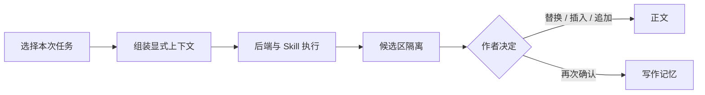
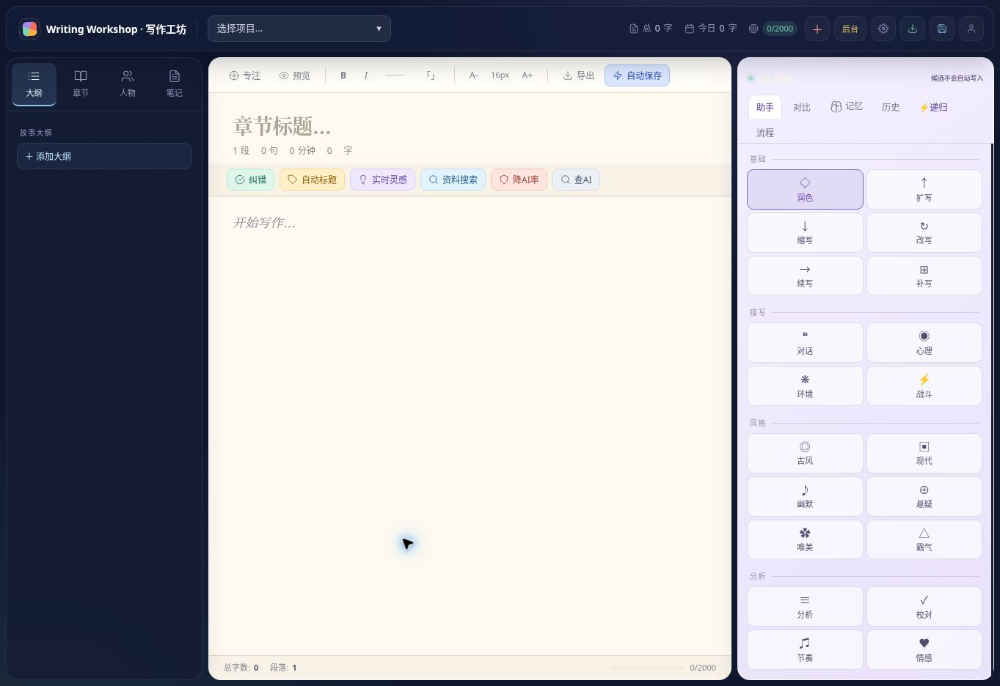
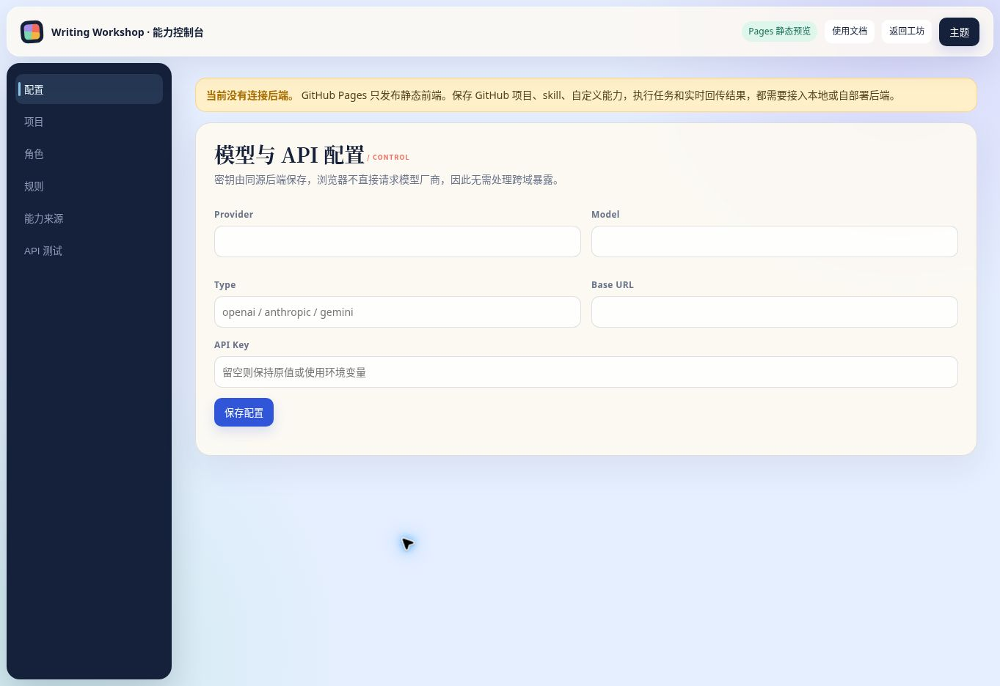

# Writing Workshop / AI 写作工坊

[](https://github.com/zizegak916-glitch/writing-workshop/actions/workflows/ci.yml)
[](LICENSE)

> 用户文档最后同步：2026-07-28（UTC+8）。完整演进记录见 [更新时间线](docs/UPDATE_TIMELINE.md)；自审记录不能替代第三方使用反馈。

一个本地优先、可审计的长篇写作工作台。它把“选哪些上下文、运行哪些 Skill、结果写到哪里”变成显式操作：AI 只生成候选，作者确认后才写入正文或记忆。

它不是聊天框的换皮，也不会把整部作品在每次调用时重新发送给模型。

> 社区认可：Writing Workshop 认可并感谢 [LINUX DO](https://linux.do/) 开源技术社区及其佬友提供的交流、测试与反馈环境。维护者的社区账号为 [The_Fo0l](https://linux.do/u/The_Fo0l)。

**正式在线版：** [GitHub Pages](https://zizegak916-glitch.github.io/writing-workshop/) · [完整使用文档](https://zizegak916-glitch.github.io/writing-workshop/docs.html) · [能力后台](https://zizegak916-glitch.github.io/writing-workshop/admin.html)

> GitHub Pages 是本项目当前正式发布的公开在线站点，`github.io` 是真实可访问的 HTTPS 域名，不是临时预览。它采用静态托管，但浏览器本地项目、编辑、笔记、分类、导入导出等功能均可正式使用。当前默认部署不附带常驻 Go API；需要密钥托管、Skill 执行或后端项目导入时，再运行本地或自部署后端。静态托管本身并不禁止 API 调用，能否调用取决于站点是否接入了可用且安全的 API 端点。

> GitHub Pages 与 OpenAI Sites 是彼此独立的托管方式。本仓库当前公开地址由 GitHub Pages 发布，不把 Pages 写成 Sites 的预览层或降级版。


## 现在能做什么

- 管理项目、章节、大纲、人物卡、项目笔记、规则和写作记忆。
- 为一次任务显式选择正文、项目、大纲、人物与记忆；桌面请求栏始终显示当前 token 估算、模型上限和上次实际用量，未配置 API 时也可先估算。
- 组合后端与 Skill 执行任务；支持 SSE 流式结果和中断。
- 逐项多选 Skill，或一键应用“长篇规划校准 / 章节修订 / 角色与对白”技能包；自定义技能包会持久化保存。
- 32 个 AI 功能都有可直接使用的内置 Prompt Skill；点击功能卡或快捷工具后，请求会隐形使用对应提示词，作者可在“流程 → Prompt Skill 管理”查看、改写或恢复默认。
- 搜索、筛选、重命名、复制、分类、导出和删除浏览器本地项目；自定义分类可修改名称、范围和颜色，也可用于写作记忆。
- 候选结果与正文分离；替换、插入、追加、写入记忆均需独立确认。
- 保存写入前快照和流程历史，避免 AI 输出静默覆盖创作内容。
- 在能力后台查看经过来源、许可证与权限初筛的 Agent Skills / MCP 公开目录；登记只生成停用元数据，不下载、不安装、不执行第三方代码。
- 在无 API Key 模式下运行本地链路测试和大纲拆分；需要模型时再配置 OpenAI 兼容服务、OpenRouter、Ollama 等后端。

## 60 秒启动

### Docker（推荐）

```bash
git clone https://github.com/zizegak916-glitch/writing-workshop.git
cd writing-workshop
docker compose up --build
```

打开 <http://127.0.0.1:8080/app.html>。首次以无密钥 demo 模式启动；可在管理页配置模型。配置保存后，容器重启会自动加载它。

健康检查：

```bash
curl http://127.0.0.1:8080/api/health
# {"mode":"demo","status":"ok"}
```

### 从源码运行

需要 Go 1.25 或更高版本。

```bash
go build -o writing-workshop ./cmd/writing-workshop
./writing-workshop serve --demo --port 8080
```

若需局域网或容器访问，显式增加 `--host 0.0.0.0`。默认只监听 `127.0.0.1`，避免意外暴露本地作品和密钥配置。

## 核心闭环

1. 在编辑器中打开正文或选择一段文字。
2. 在“流程”页选择本次任务、上下文和 Skill。
3. 在右侧固定请求栏检查将发送的上下文预算；功能目录滚动时，补充指令、预算和生成按钮仍保持可见。
4. 输出进入候选区，不会自动修改作品。
5. 作者选择替换、插入、追加，或另行确认为记忆。
6. 写入前状态保存在流程历史中，可回看和恢复。

这个闭环是 Writing Workshop 与继承引擎能力之间的产品边界：引擎可以生成，工作台负责上下文控制、权限可见、结果确认和创作数据管理。


```mermaid
flowchart LR
    A[选择本次任务] --> B[组装显式上下文]
    B --> C[后端与 Skill 执行]
    C --> D[候选区隔离]
    D --> E{作者决定}
    E -->|替换 / 插入 / 追加| F[正文]
    E -->|再次确认| G[写作记忆]
```

## 界面与导航

新版界面采用“彩色编辑部”设计：深色资料栏、暖纸张编辑器和淡紫 AI 区承担不同职责，钴蓝、珊瑚、薄荷和琥珀只用于表达动作和状态。桌面保留三栏生产布局，移动端切换为底部任务导航。



| 页面 | 作用 |
|---|---|
| `index.html` | 产品说明、运行模式和 60 秒启动入口 |
| `app.html` | 项目、章节、大纲、人物、笔记、记忆、分类、导入导出、多 Skill 与候选写入 |
| `admin.html` | Provider、Model、Base URL、API Key、项目、规则、能力、公开 Agent Skills / MCP 目录、技能包、分类与 API 调试 |
| `docs.html` | 从 Pages 在线版 / 后端增强模式到 CORS、Skill 与故障排查的完整教程 |

代码、文档、CI、Pages 与公开实测的对应关系见 [更新时间线](docs/UPDATE_TIMELINE.md)，避免只凭截图、文件名或聊天记录判断功能是否已经上线。

视觉规范与组件约束见 [UI 设计系统](docs/UI_DESIGN_SYSTEM.md)。

后台不是装饰页：Provider、Model、Base URL、API Key、项目、角色、规则、能力来源与 API 测试都有明确入口。Pages 中显示“在线版 · 浏览器本地数据”；连接同源或自部署 API 后，再启用对应的服务端能力。



## Skill / 能力协议

Writing Workshop 明确区分两类 Skill：

- **浏览器 Prompt Skill**：对应润色、续写、对白、校对、标题、实时灵感等 32 个 AI 功能。选择功能后，其提示词在请求组装时自动加入，普通创作界面不显示全文；“流程 → Prompt Skill 管理”可搜索、查看、编辑、恢复、单独导入导出。自定义值写入当前域名的 `localStorage`，项目 v4 备份也会携带这些覆盖值并在导入时合并恢复。
- **后端能力 Skill**：由 manifest 声明步骤、权限和入口，可多选并通过 `/api/run` 执行；这类能力仍遵循下面的协议和服务端安全边界。

修改浏览器 Prompt Skill 不会改变内置源文件，也不会把提示词显示在正文或结果中。额外指令仍会附加在所选 Skill 之后，因此一次请求的实际顺序是“功能 Prompt Skill → 当前文本 → 输出长度/创意要求 → 项目上下文 → 作者额外指令”。

能力清单不是任意远程代码执行入口。仓库当前只登记、校验和组合 manifest；第三方代码必须经过未来的沙箱执行器才允许运行。

能力后台的“公开能力目录”包含官方或可核验上游入口、许可证提示、权限和风险。目录以现行 `openai/plugins`、Agent Skills 开放标准、Anthropic Skills、SkillPort 和 MCP 官方来源为主；已弃用的 `openai/skills` 只保留迁移警告。`POST /api/external-catalog` 只把选中条目登记为 `enabled=false` 的 `external:*` 元数据；后端会拒绝启用或运行这种入口。它用于审查和规划接入，不是假装已经完成第三方 Skill 沙箱。

最小 manifest：

```json
{
  "name": "场景节奏检查",
  "type": "skill",
  "category": "revision",
  "tags": ["节奏", "修订"],
  "version": "1.0.0",
  "source": "https://github.com/example/scene-pacing",
  "license": "Apache-2.0",
  "entry": "prompt:scene-pacing",
  "output": "text",
  "instructions": "保持事件顺序，只指出节奏断点并给出候选修改。",
  "steps": ["读取显式上下文包", "检查场景节奏", "返回候选文本"],
  "permissions": ["context:read"],
  "supports_stream": true,
  "supports_abort": true,
  "enabled": true
}
```

完整字段和 API 示例见 [能力协议](docs/CAPABILITY_PROTOCOL.md) 与 [API 文档](API.md)。

技能包不是新的执行权限，而是一组可见的 `skill_ids` 预设。工作台应用技能包后，仍会显示选中数量，并把所有 Skill ID 显式传给 `/api/run`。分类有两处真实存储边界：工作台项目分类保存在当前浏览器，能力后台分类保存在当前后端工作目录的 `.ainovel/categories.json`。

## 数据与安全边界

- Pages 和工作台中的项目、章节、大纲、人物、笔记与记忆以当前域名的 IndexedDB / `localStorage` 为浏览器数据源；清除站点数据前应导出 v4 项目包。
- Go 后端工作目录与浏览器数据库是两套明确存储。浏览器不会把每次编辑静默镜像到单个后端项目；需要后端资料时，由作者在项目操作台显式执行“从自部署后端导入”。
- 浏览器模型请求使用同源 `/api/`，不直接把厂商密钥写进公开前端，从根源上避开 CORS 密钥暴露。
- 默认监听回环地址；如使用 `0.0.0.0`，请只在可信网络或反向代理鉴权后开放。
- API Key 可使用环境变量，不必写入仓库；配置读取时会对外隐藏密钥。
- 多模型槽位只保留 Provider / Model，不在浏览器 `localStorage` 持久化真实 Key；所用 Provider 应先在自部署后端配置。
- 保存 GitHub URL 不等于执行仓库代码。

详见 [配置指南](CONFIG.md) 与 [安全策略](SECURITY.md)。

## 项目结构

```text
cmd/writing-workshop/  项目可执行入口
internal/web/       同源 Web API、SSE、能力执行与数据管理
web/static/         本地优先的写作工作台、项目管理扩展与 SVG 图标
internal/store/     后端章节、大纲、人物、记忆和运行状态
tests/              Playwright 浏览器产品烟雾测试
examples/           可复用能力 manifest 与技能包请求示例
docs/               协议、来源与设计说明
```

## 路线图

- `v0.1`：无密钥启动、显式上下文包、候选确认、Skill manifest、CI 与跨平台发布。
- `v0.2`：项目导入/导出包 v4 已覆盖项目、章节、大纲、人物、笔记、记忆、自定义分类与浏览器 Prompt Skill 覆盖值；Playwright 产品烟雾测试已进入 CI。
- `v0.2.1`：稳定性维护版；补旧项目包迁移、候选历史恢复、跨文档写入保护、OpenAI/Anthropic 本地模拟契约和 Go 格式门禁。
- `v0.3`：最小权限的本地 Skill 沙箱与增量资料摄取。

公开任务请使用 [GitHub Issues](https://github.com/zizegak916-glitch/writing-workshop/issues)。提交代码前阅读 [CONTRIBUTING.md](CONTRIBUTING.md)。

## 当前验证边界

- 仓库有 65 个 Go `_test.go` 文件，覆盖后端多个包；这不等于“核心业务 100% 单元测试覆盖”，仓库目前没有发布覆盖率数字。
- Playwright 验证项目/笔记持久化、v1-v3 → v4 迁移、候选生成/确认写入/刷新恢复/写入前恢复、跨文档保护、导入预览安全、上下文预算和移动端入口；它仍不是像素级 UI 回归测试。
- OpenAI 与 Anthropic 适配在 CI 中使用本地模拟服务校验请求/响应契约，不消耗真实密钥，也不能替代各供应商生产网络的兼容性测试。
- 第三方用户数、连续一周使用和数据完整性仍缺独立证据。愿意测试者可提交 [7 天真实写作反馈](https://github.com/zizegak916-glitch/writing-workshop/issues/new?template=field-test.yml)，不需要提供私稿。

[Releases](https://github.com/zizegak916-glitch/writing-workshop/releases) 提供版本化二进制与校验和；从源码或 Docker 使用仍然受支持。

维护者社区账号：[Linux DO · The_Fo0l](https://linux.do/u/The_Fo0l)。

维护者可使用 `make check` 运行与 CI 对齐的本地检查。Codex for Open Source 的证据清单与申请草稿见 [docs/CODEX_FOR_OSS_APPLICATION.md](docs/CODEX_FOR_OSS_APPLICATION.md)。

## 来源与许可证

本项目的 Go 写作引擎源自 Apache-2.0 许可的 [`voocel/ainovel-cli`](https://github.com/voocel/ainovel-cli)。本仓库保留原作者版权、提交历史和 Apache-2.0 许可证，并在其上开发独立的 Writing Workshop Web 产品层、能力协议、显式上下文工作流与发布设施。继承引擎的历史技术说明保存在 [docs/UPSTREAM_ENGINE.md](docs/UPSTREAM_ENGINE.md)。
